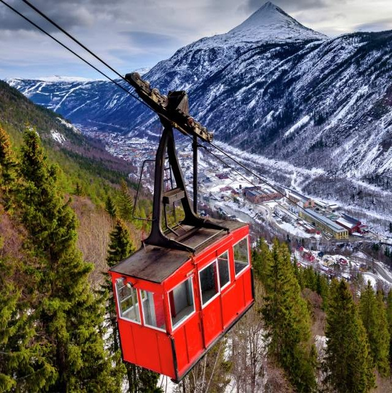

# This is a short bio of myself

## Who I am
Hey! My name is Vanessa and I am from Peru. 
* I studied economics and have experience in macroeconomic policy and finance. 
 Right now, I am a first year MIDP student and I am interested in education policy and poverty alleviation. 
* Related to education policy, I would like to focus my career on the impact of eduction on girls and women empowerment, for example, in variables such as success and future happiness, number of children they have in the future, number of generation to escape poverty, etc. 
* I also really like to explore the impact investing world because I have a little experience working on that when I was in my home country and I like it. But I want to explore all my options in both sides.

## Something I recently read
I have been reading this article from UNESCO: [Article from UNESCO] (https://www.unesco.org/en/articles/key-data-girls-and-womens-right-education)

## Somewhere I wanna go
I would like to go to this place one day, it is in Norway: 
